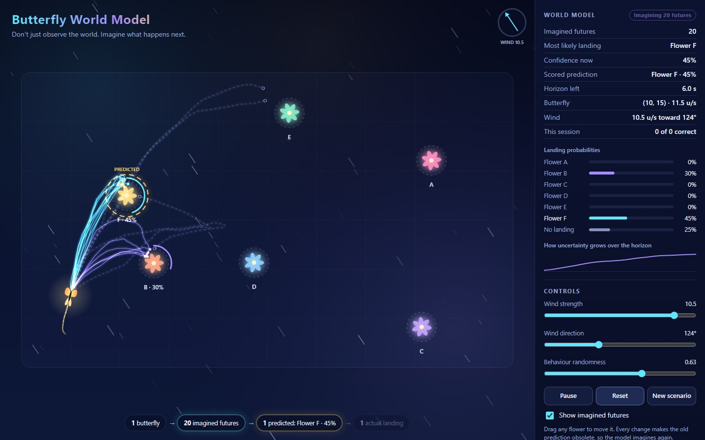
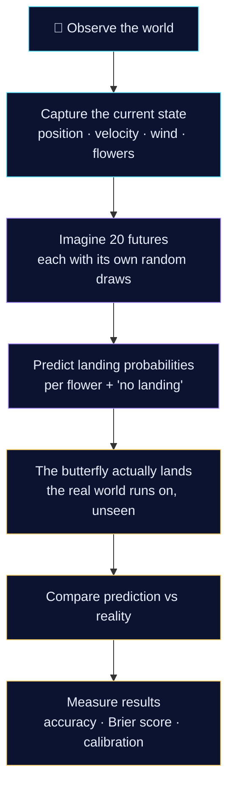
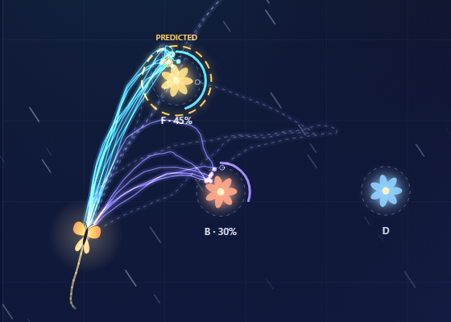
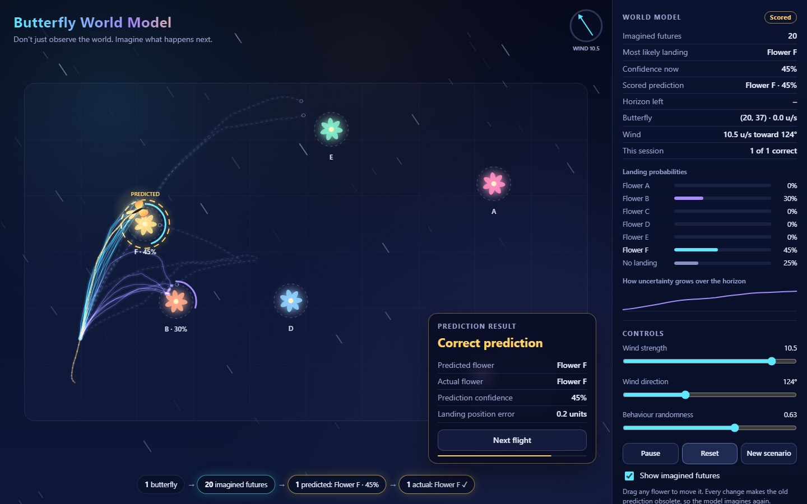

# Butterfly World Model — Predicting the Next Landing

> *Don't just observe the world. Imagine what happens next.*

**One butterfly. Twenty imagined futures. One real landing. A measurable prediction.**

[](docs/video/butterfly-world-model-showcase.mp4)

### ▶ [Watch the showcase video (77 seconds)](docs/video/butterfly-world-model-showcase.mp4)

Recorded from the running application, 1080p, with ambient music by Yoiyami (CC0). Hebrew subtitles are provided as [WebVTT](docs/video/butterfly-world-model-showcase.he.vtt). On GitHub, open the link and choose *View raw* to download and play it.

To play it from a clone of the repository, run one of these from the project folder:

```bash
start docs\video\butterfly-world-model-showcase.mp4      # Windows (cmd or PowerShell)
open docs/video/butterfly-world-model-showcase.mp4       # macOS
xdg-open docs/video/butterfly-world-model-showcase.mp4   # Linux
```

With the Hebrew subtitles, using [VLC](https://www.videolan.org/vlc/):

```bash
vlc docs/video/butterfly-world-model-showcase.mp4 --sub-file docs/video/butterfly-world-model-showcase.he.vtt
```

> **What this is, and is not.** A compact, simulation-based proof of concept. The "world model" here is a small set of hand-written rules rolled forward with random sampling. It is **not** a trained neural world model, and nothing in it learns.

## What did we build?

A butterfly flies through a small virtual garden, pushed around by wind and by its own changes of mind. One second into every flight, a prediction engine looks at what can be seen — where the butterfly is, how fast it is moving, where the flowers are, how the wind blows — and imagines twenty different ways the flight could continue. From those twenty futures it names the flower it thinks the butterfly will land on, and says how sure it is.

Then the real butterfly finishes its flight, and we check whether the prediction was right.

## Why does it matter?

Most software reacts to what is happening now. A *world model* goes one step further: it keeps an internal picture of how the environment behaves, uses that picture to imagine what might happen next, and then compares what it imagined with what really happened.

That idea is at the heart of a line of research on model-based agents ([World Models](https://worldmodels.github.io/), [Dreamer](https://arxiv.org/abs/1912.01603), [PETS](https://arxiv.org/abs/1805.12114)). Those systems *learn* their world model from data and use it to choose actions. This project does something much smaller: its model of the garden is written by hand, and nothing is trained. What it does show, in a form you can watch and measure, is the loop those papers build on — represent the world, imagine several futures, keep track of uncertainty, and score the result against reality.

## How does it work?



The real garden and the prediction engine are two separate programs inside the API. The engine only receives what a camera could see. It is never told which flower the butterfly is heading for, what the next gust will be, or what random numbers the garden will draw. It has to guess those, which is exactly why its twenty futures disagree with each other.

| | |
|---|---|
|  |  |
| **Twenty imagined futures.** Cyan paths end on the most likely flower, violet on other flowers, dashed grey ones never land in time. | **The real landing.** The gold trail is what actually happened; the card scores the frozen prediction against it. |

## Key capabilities

- **A living garden** — animated butterfly, flowers, wind and pollen on a single Canvas, at real-time speed.
- **Twenty futures at a glance** — the flight pauses for a moment while the imagined paths unfurl, then the model keeps re-imagining as the butterfly flies.
- **Honest probabilities** — every flower gets a probability, and so does "no landing within six seconds".
- **Change the world** — drag flowers, turn the wind, raise the butterfly's randomness. Old predictions are thrown away and replaced immediately.
- **A prediction you can score** — predicted flower, actual flower, confidence and landing position error after every flight.
- **A real benchmark** — 500 reproducible scenarios, two baselines, runnable from the UI or the command line.

## Evaluation highlights

Measured on 500 scenarios (seeds 0–499) that were never used for tuning. Full method and failure analysis: [docs/evaluation.md](docs/evaluation.md).

| Predictor | Top-1 accuracy | Brier score (0–2, lower is better) | Mean landing error |
|---|---|---|---|
| **World model, 20 futures** | **72.0%** | **0.422** | **6.0 units** |
| Nearest flower (baseline) | 57.6% | 0.848 | 11.4 units |
| Constant velocity (baseline) | 36.6% | 1.268 | 9.3 units |

- The model's confidence is close to honest: when it says about 88%, it is right 84% of the time (calibration error 0.039).
- A prediction takes about 4 ms (median) on a laptop.
- It is far from perfect. It is wrong in 28% of scenarios, and it recognises only 13 of the 57 flights that never land.


## Quick start

You need Docker. Nothing else — no accounts, keys or cloud services.

```bash
docker compose up --build
```

Then open **http://localhost:8080**. (The API is also reachable directly at http://localhost:8000, with interactive docs at `/docs`.) Stop with `Ctrl+C` or `docker compose down`. If a port is taken: `WEB_PORT=9090 API_PORT=9000 docker compose up --build`.

Reproduce the benchmark:

```bash
docker compose exec api python -m experiments.run_evaluation --out /tmp/results
```

Run the tests locally (Python 3.12, Node 22+):

```bash
python -m venv .venv && .venv/bin/pip install -r requirements-dev.txt   # Windows: .venv\Scripts\pip
.venv/bin/python -m pytest                    # backend: simulation, prediction, metrics, API
.venv/bin/python -m experiments.run_evaluation  # rewrites experiments/results/
cd web && npm ci && npm run typecheck && npm test
npx playwright install chromium && npm run e2e  # browser test against the running Docker app
```

## Research foundation

| Paper | Idea borrowed |
|---|---|
| Ha & Schmidhuber, [*World Models*](https://worldmodels.github.io/) (2018) | Separate "what the world is" from "what happens next", and roll the model forward as a dream. |
| Hafner et al., [*Dream to Control*](https://arxiv.org/abs/1912.01603) (2019) | Reason about the future through imagined trajectories from the current state. |
| Chua et al., [*PETS*](https://arxiv.org/abs/1805.12114) (2018) | Carry uncertainty forward by propagating many sampled particles instead of one best guess. |

This project **does not reproduce any of these papers**. There is no neural network, no learning and no control. Details, including what was deliberately left out: [docs/research-foundation.md](docs/research-foundation.md).

## Known limitations

- **Nothing is learned.** The prediction engine is given the rules of the garden; only the hidden intent, gusts and random draws are unknown to it. A learned model would also have to discover the rules.
- **The model is "well specified".** Predictor and world share the same documented equations, which is the easiest possible setting. Real environments never match the model this well.
- **Twenty samples are coarse.** Probabilities move in steps of 5%, and rare outcomes such as "no landing" are often missed.
- **A toy world.** Two dimensions, one butterfly, a few flowers, and no real butterfly aerodynamics or behaviour.
- **Single user.** The live garden is one in-memory world shared by every browser tab that connects.

## More documentation

- [Architecture](docs/architecture.md) — the two services and what each part is responsible for.
- [Simulation and prediction](docs/simulation-and-prediction.md) — the world's rules, how futures are imagined, and how information leaks are prevented.
- [Evaluation](docs/evaluation.md) — method, metrics, baselines, results and failures.
- [Research foundation](docs/research-foundation.md) — the papers, what inspired what, and future directions.
- [Showcase video](docs/showcase-video.md) — storyboard, how it was recorded, and licensing.
- [QA summary](docs/qa-summary.md) — what was checked before closing the project, and the outcome.
