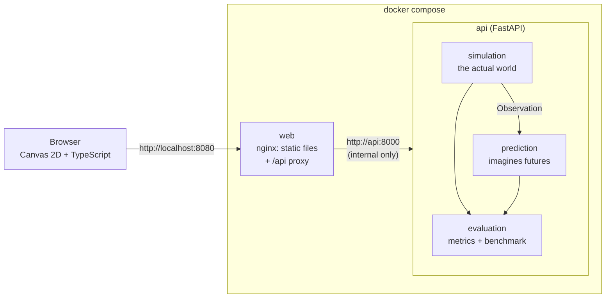
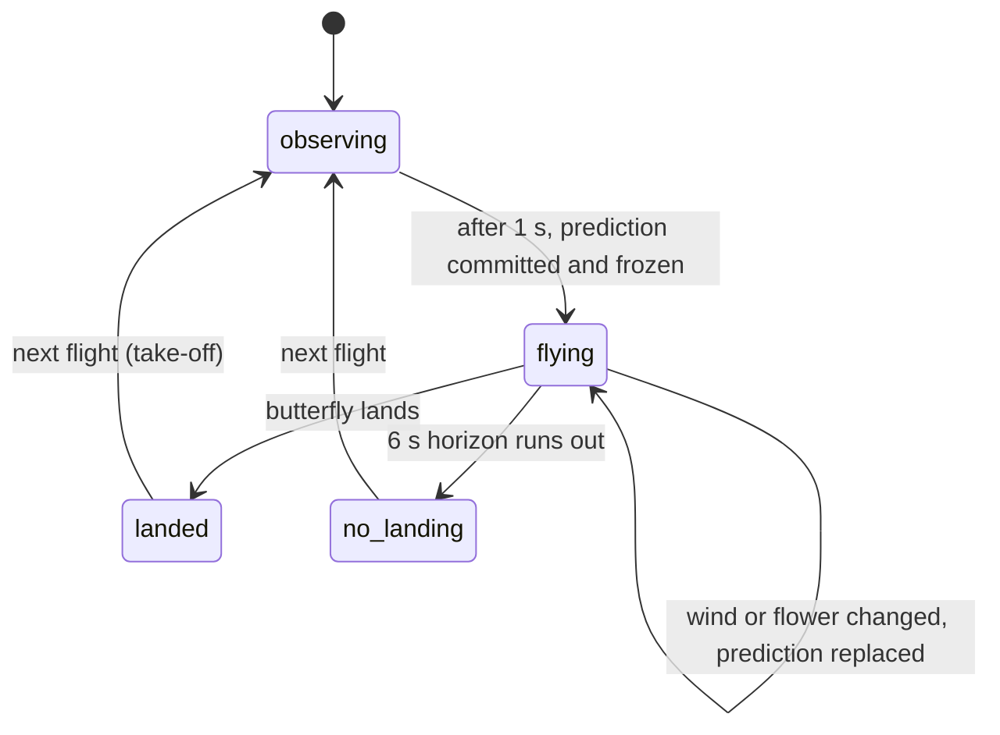

# Architecture

The system is deliberately small: two containers, no database, no message queue, no external service. All state lives in memory.

## Why the browser never sees an internal hostname

The frontend only ever requests relative URLs such as `/api/world/step`. In Docker, nginx in the `web` container serves the static files and forwards `/api/*` to the `api` service over the Compose network. In local development, the Vite dev server does the same forwarding to `localhost:8000`. The name `api:8000` exists only inside nginx's configuration. The browser test asserts that every request the page makes goes to its own origin.

## Components

| Path | Responsibility |
|---|---|
| `api/params.py` | The documented constants of the garden (speeds, wind coupling, landing rules). The only thing simulation and prediction share. |
| `api/contracts.py` | Pydantic data contracts: `Observation` (what may be seen), `Prediction`, `Future`. |
| `api/simulation/world.py` | The actual world: stochastic step function, hidden intent and gust, private random generator, scenario generation from a seed. |
| `api/prediction/predictor.py` | The prediction engine: intent belief and a vectorised rollout of N futures. Takes an `Observation`, never the world. |
| `api/prediction/baseline.py` | Two simple baselines: constant velocity and nearest flower. |
| `api/evaluation/metrics.py` | Pure metric functions: Brier score, calibration, Wilson interval, latency statistics. |
| `api/evaluation/experiment.py` | The benchmark loop: snapshot, predict, freeze, run the world, compare. |
| `api/session.py` | The live demo session: one world, the committed prediction, and the flight cycle. |
| `api/main.py` | FastAPI routes and request validation. |
| `experiments/` | `run_evaluation.py` writes the result files; `tune.py` selects the one tuned parameter. |
| `web/src/main.ts` | Application state, the step loop, interaction, and the side panels. |
| `web/src/render.ts` | Everything drawn on the canvas. |
| `web/src/geometry.ts` | Small pure helpers (coordinate transform, path slicing), unit tested. |
| `tests/`, `web/e2e/` | pytest suite and the Playwright browser tests. |

## The flight cycle

The live session moves through four states:

Two kinds of prediction appear in the UI:

- The **committed prediction** is made once, at the snapshot, and frozen. It is the one that gets scored. Changing the wind or moving a flower makes it obsolete, so the server replaces it and restarts the six-second horizon.
- The **live prediction** is refreshed about every 0.7 s from the newest observation, with the remaining horizon. It drives the trajectories and probability arcs you see during the flight and never affects scoring.

Every response carries a `config_version` number. The frontend discards any prediction whose version is not current, so trajectories computed for an older wind or flower layout are never drawn.

## API

| Endpoint | Purpose |
|---|---|
| `GET /health` | Liveness check, used by the container health check. |
| `GET /api/world/state` | Current observable state, flight status, committed prediction summary, last result. |
| `POST /api/world/step` | Advance the actual world by 1–50 steps. |
| `POST /api/world/config` | Change wind, randomness or flower positions. |
| `POST /api/world/reset` | Restart the same seed, a given seed, or the next scenario. |
| `POST /api/world/next` | Start the next flight after a result. |
| `GET /api/world/prediction` | The full committed prediction, with trajectories. |
| `POST /api/predict` | Imagine futures for the live world, or for any observation you send. |
| `POST /api/evaluate` | Run the benchmark (default 500 scenarios) and return the metrics. |

Requests are validated with Pydantic: unknown fields, negative step counts, wind outside 0–12, flowers outside the garden, unknown flower ids and oversized sampling requests are rejected with status 422 and change nothing.

## Design choices

- **Canvas 2D, no framework.** One animated scene and a few panels do not need React or WebGL. The production JavaScript bundle is under 10 kB gzipped.
- **The server owns time.** The browser asks for one 0.1 s step every 100 ms and interpolates between the last two positions for smooth motion. When the tab is hidden or the demo is paused, it stops asking and stops drawing.
- **Determinism.** A seed fixes the garden layout, the world's random stream and the predictor's random stream (three separate streams). The same seed and the same requests give the same flight.
