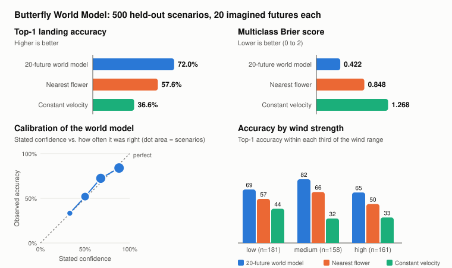

# Evaluation

A demo can look convincing and still be wrong most of the time. This page describes how the prediction engine was measured, what the numbers are, and where it fails.

All numbers below are copied from [`experiments/results/metrics.json`](../experiments/results/metrics.json), produced by:

```bash
python -m experiments.run_evaluation
# or, inside the running container:
docker compose exec api python -m experiments.run_evaluation --out /tmp/results
```

The run writes `metrics.json`, `scenarios.csv` (one row per scenario) and `results.svg`. Everything except the latency figures is fully determined by the seeds; the same metrics were obtained natively on Windows and inside the Linux container.

## Method

500 independent scenarios, seeds 0 to 499. For each one:

1. **Build the garden** from the seed: 3–6 flowers, a starting point away from them, wind strength 0–12 in a random direction, randomness 0.1–1.0.
2. **Fly for one second.** Landing is not possible yet; this gives the butterfly a meaningful velocity.
3. **Take the snapshot** — the observation at that moment.
4. **Predict and freeze.** The world model (20 futures, 6 s horizon) and both baselines make their predictions from the snapshot. Nothing can change them afterwards.
5. **Run the actual world** for up to six seconds, using its own random stream.
6. **Record** where the butterfly landed, or that it did not land in time.
7. **Compare and aggregate.**

**Out-of-sample.** The engine has one tuned parameter: how strongly the butterfly's heading counts as evidence of its intent. It was chosen with `python -m experiments.tune` on seeds 100000–100299, by taking the smallest value whose Brier score was within 0.01 of the best. Those seeds do not overlap the evaluation seeds. The baselines have no parameters.

## Metrics

- **Top-1 accuracy.** How often the highest-probability outcome was what happened. "No landing within the horizon" counts as an outcome like any flower.
- **Multiclass Brier score.** The squared distance between the predicted probabilities and what happened, summed over all outcomes including "no landing". 0 is perfect, 2 is confidently wrong. Unlike accuracy, it rewards honest uncertainty.
- **Landing position error.** Distance between the predicted landing point and the real one. It is only defined when a flower was predicted *and* the butterfly landed; the share of scenarios where that holds is reported as coverage.
- **Calibration.** Predictions are grouped by stated confidence and compared with how often they were right. The expected calibration error (ECE) is the average gap.
- **Latency.** Wall-clock time of one prediction call, reported as percentiles.

## Results

Of the 500 flights, 443 ended on a flower and 57 did not land within six seconds.

| | World model (20 futures) | Nearest flower | Constant velocity |
|---|---|---|---|
| Top-1 accuracy | **72.0%** | 57.6% | 36.6% |
| 95% interval (Wilson) | 67.9% – 75.8% | 53.2% – 61.9% | 32.5% – 40.9% |
| Brier score | **0.422** | 0.848 | 1.268 |
| Landing error, mean (units) | **6.0** | 11.4 | 9.3 |
| Landing error, median (units) | **1.0** | 2.6 | 3.6 |
| Landing error coverage | 86.8% | 88.6% | 39.4% |
| Calibration error (ECE) | **0.039** | 0.424 | 0.634 |

For scale: the garden is 100 × 60 units and a landing zone has a radius of 3. The mean landing error is dominated by scenarios where the wrong flower was predicted; when the model picks the right flower its mean error is 0.9 units.

The world model's accuracy interval does not overlap either baseline's. Comparing scenario by scenario with the stronger baseline: the model is right where nearest-flower is wrong in 91 scenarios, and wrong where nearest-flower is right in 19.



### Calibration of the world model

| Stated confidence | Scenarios | Average confidence | Actually correct |
|---|---|---|---|
| 20–40% | 12 | 33% | 33% |
| 40–60% | 102 | 50% | 52% |
| 60–80% | 181 | 68% | 72% |
| 80–100% | 205 | 88% | 84% |

The model is slightly over-confident at the top and slightly under-confident in the middle, by a few points either way. The baselines always claim 100% confidence, which is why their calibration error is large.

### Latency

One 20-future prediction takes about 4 ms at the median, about 7 ms at the 90th percentile and 12–15 ms at the 99th, measured on the development laptop (single thread, NumPy). These figures vary from run to run and machine to machine; the exact values of the committed run are in `metrics.json`. The baselines take a few microseconds.

### By conditions

| Wind strength | Scenarios | World model | Nearest flower | Constant velocity |
|---|---|---|---|---|
| Low (0–4) | 181 | 69.1% | 56.9% | 44.2% |
| Medium (4–8) | 158 | 82.3% | 65.8% | 31.6% |
| High (8–12) | 161 | 65.2% | 50.3% | 32.9% |

| Randomness | Scenarios | World model | Nearest flower | Constant velocity |
|---|---|---|---|---|
| Low (0–0.4) | 180 | 73.9% | 56.1% | 41.7% |
| Medium (0.4–0.7) | 162 | 72.8% | 54.9% | 34.0% |
| High (0.7–1.0) | 158 | 69.0% | 62.0% | 33.5% |

## Where it fails

- **Flights that never land.** Of the 57 no-landing flights, the model named "no landing" as the most likely outcome in only 13. On average it gave that outcome 32% probability. These 44 misses are almost a third of all 140 errors.
- **Confident mistakes.** 33 of the 140 errors were made at 80% confidence or more. Usually the butterfly changed its mind after the snapshot — something no observer could have known.
- **Strong wind.** Accuracy drops to 65% in the highest wind band, where gusts decide whether the butterfly can settle at all.
- **Calm air is not the easiest case.** Accuracy at low wind (69%) is lower than at medium wind (82%). We have not investigated why; one plausible reason is that with little wind more flowers remain reachable within the horizon. This is a guess, not a finding.
- **Nearest flower sometimes wins.** In 19 scenarios the trivial baseline was right and the model was wrong.

## Limitations of this evaluation

- **Same rules on both sides.** The predictor knows the true form of the dynamics. These results measure how well sampling handles hidden state and noise, not how well a model of an unfamiliar world would do.
- **One environment family.** All scenarios come from the same generator; nothing is known about behaviour outside its ranges.
- **Sample sizes.** With 500 scenarios, accuracy is known to about ±4 points; the per-condition tables rest on roughly 160–180 scenarios each and are correspondingly less certain. Individual predictions use only 20 samples.
- **Calibration bins are coarse.** Five bins, the lowest of them empty.
- **Latency is indicative only.** It was measured on one machine, inside the benchmark loop, without warm-up control.
